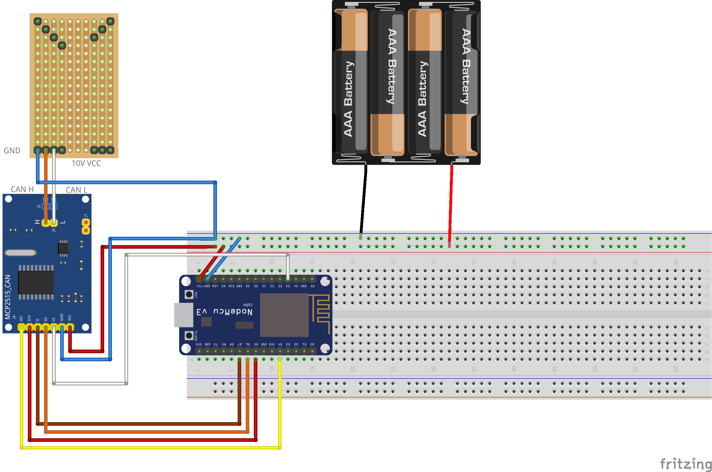

# Debug tooling for B* ebike system 2016 and later

## Overview

This debug tooling enables reading canbus information from the b* ebike system.

The tooling consists of the following parts:

1. Adapter for intercepting data from the Display connector port.
2. Platform.io project for an esp8266 to send the intercepted canbus frames to a smartphone/laptop via wifi. 
3. dbc file for dumping the received traces.

## How to use

### Adapter

1. 3D print the connector from the stl file in 'connector'
2. Cut a euroboard with stripe pattern to the required size.
3. Get some 2mmx9.5mm Pogo pins. Solder them to the board and use a lot of solder to create contact points for the pins coming from the display. 
4. Wire everything up

#### Links

[euroboard](https://www.amazon.de/Euro-Platine-160x100-mm-Lochrasterplatine-Kupfer/dp/B002NL5YQY)
[pogo pins](https://www.amazon.de/gp/product/B07FPCPX8X/ref=ppx_yo_dt_b_search_asin_title?ie=UTF8&psc=1)

### ESP8266 Firmware

1. Adapt the wlan SSID and Key in `esp8266/src/settings.h.sample`
2. Rename `esp8266/src/settings.h.sample` to `esp8266/src/settings.h`
3. Compile the esp8266 firmware with pio and flash it to an esp8266
4. Attach a cheap MCP2515 transiver to the esp8266. (See picture)
5. Power the esp8266 via a usb power supply
6. Connect to the esp8266 via wifi on port 5001

    nc <esp_ip> 5001

7. You should now see received canbus frames 

### Dumping frames

1. Install can tool via `pipenv install` in `tracereader`
2. Enter venv shell via `pipenv shell`

     cat dumpfile | cantools decode -s drive.dbc
